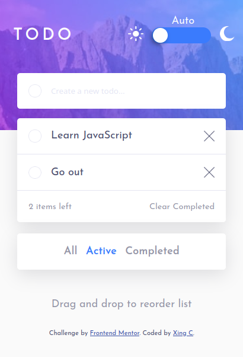

# Frontend Mentor - Todo app solution

This is a solution to the [Todo app challenge on Frontend Mentor](https://www.frontendmentor.io/challenges/todo-app-Su1_KokOW). Frontend Mentor challenges help you improve your coding skills by building realistic projects.

## Table of contents

- [Overview](#overview)
  - [The challenge](#the-challenge)
  - [Screenshot](#screenshots)
  - [Links](#links)
- [My process](#my-process)
  - [Built with](#built-with)
  - [What I learned](#what-i-learned)
- [Acknowledgments](#acknowledgments)

## Overview

### The challenge

Users should be able to:

- View the optimal layout for the app depending on their device's screen size
- See hover states for all interactive elements on the page
- Add new todos to the list
- Mark todos as complete
- Delete todos from the list
- Filter by all/active/complete todos
- Clear all completed todos
- Toggle light and dark mode
- **Bonus**: Drag and drop to reorder items on the list

### Screenshots




### Links

- Solution URL: [Simple Todo List](https://xingcdev.github.io/simple-to-do-list/)

## My process

### Built with

- Semantic HTML5 markup
- CSS Preprocessor SCSS
- CSS Flexbox
- JavaScript ES6
- Mobile-first workflow

### What I learned

#### Border radius is not working

The child div's overflow can give the impression that the border-radius isn't working.

```css
.todo-body {
	overflow: hidden;
	border-radius: 5px;
}
```

Source: [css - border-radius not working - Stack Overflow](https://stackoverflow.com/a/53964887)

#### Theming (dark mode)

It's good practice to make 3 modes for the theming.

- Light mode
- Dark mode
- System - the theme is set by the system.

The `system` choice let users to say: I prefer my OS to be light but to switch to dark mode at night.
The users can switch the theme automatically using the OS setting.

I've created the `data-theme` HTML attribute on the root element to store theme value `auto`, `light` or `dark`.

```html
<html lang="en" data-theme="auto"></html>
```

By default, the website is in the light mode. When the theme is `auto`, `prefers-color-scheme` detects if the user has chosen light or dark mode in operating system setting. If the user has chosen the dark mode, the dark styles inside the `@media (prefers-color-scheme: dark)` will be applied.

When the dark theme is turn on, the dark styles inside the `:root[data-theme='dark']` will be applied.

```css
:root {
    // Light mode
    --bg-color: var(--light-bg);
    --text-color: var(--light-text);
    --theme-color: var(--light-theme);
    ...
}

:root[data-theme='auto'] {
    @media (prefers-color-scheme: dark) {
        --bg-color: var(--dark-bg);
        --text-color: var(--dark-text);
        --theme-color: var(--dark-theme);
        ...
    }
}

:root[data-theme='dark'] {
    --bg-color: var(--dark-bg);
    --text-color: var(--dark-text);
    --theme-color: var(--dark-theme);
    ...
```

see: [Your dark mode toggle is broken - Kilian Valkhof](https://kilianvalkhof.com/2020/design/your-dark-mode-toggle-is-broken/)

#### Storing todos in the local storage

The [localStorage API](https://developer.mozilla.org/en-US/docs/Web/API/Window/localStorage) is used to store the data in the web browser. Using local storage means that the data will **not** be cleared even if the page is closed.

The code below stores the todos in the localStorage:

```javascript
const updateLocalStorage = function () {
	// Only strings may be stored in the localStorage,
	// so we need to convert our todos array to a JSON string
	window.localStorage.setItem('todosRef', JSON.stringify(todos));
};
```

When the page is loaded, the function below gets todos from the localStorage and will render them on the page:

```javascript
const restoreTodos = function () {
	const todosRef = window.localStorage.getItem('todosRef');
	if (todosRef) {
		todos = JSON.parse(todosRef);
		todos.forEach((todo) => {
			updateTodoOnDOM(todo);
		});
	}
};
```

#### Drag And Drop

I created drag and drop feature using [HTML Drag and Drop API](https://developer.mozilla.org/en-US/docs/Web/API/HTML_Drag_and_Drop_API).

The 2 articles below helped me to make a sortable to-do list:

[How To Create Drag and Drop Elements with Vanilla JavaScript and HTML - DigitalOcean](https://www.digitalocean.com/community/tutorials/js-drag-and-drop-vanilla-js)

[Make a Sortable List With Draggable Items Using JavaScript - Better Programming](https://betterprogramming.pub/create-a-sortable-list-with-draggable-items-using-javascript-9ef38f96b258)

The Drag And Drop code is in the `dragAndDrop.js`.

```javascript
const createTodoOnDOM = function (todo) {
    const newItem = document.createElement('li');
    ...
    newItem.setAttribute('draggable', true);
    newItem.addEventListener('dragstart', onDragStart);
    newItem.addEventListener('dragend', onDragEnd);
```

First of all, we have to make each HTML todo item draggable with the HTML attribute `draggable`, then we attach them a event listener for the event `dragstart` (when the user starts dragging the todo item) and `dragend` (when the user release the mouse button).

```javascript
const dropZone = document.querySelector('.todo-items');
dropZone.addEventListener('dragover', onDragOver);
dropZone.addEventListener('drop', onDrop);
```

Then, we attach the drop zone—the place we drop the todo item. in this case, the HTML list— a event listener for the event `dropover` (when the dragged item is being dragged over the drop zone,) and `drop` (when the element is dropped on the drop zone).

These are functions attached to the event listeners:

```javascript
export const onDragStart = function (event) {
	const currentDragEvent = event;

	// Start by clearing existing data
	event.dataTransfer.clearData();
	// Identify the current dragged element by adding a id
	currentDragEvent.dataTransfer.setData(
		'text/plain',
		currentDragEvent.target.getAttribute('data-id')
	);

	const currentDraggedElement = event.target;
	currentDraggedElement.classList.add('isDragging');
};
```

```javascript
export const onDragEnd = function (event) {
	const currentDraggedElement = event.target;
	currentDraggedElement.classList.remove('isDragging');
};
```

```javascript
export const onDragOver = function (event) {
	// Make the drop target(i.e div) droppable
	event.preventDefault();

	// On recupère l'index de l'element sur lequel on est en train de survoler
	function findIndexOfUnderDragged() {
		const underDraggedEl = event.target;
		const underDraggedId = underDraggedEl.dataset.id;
		if (!underDraggedEl.classList.contains('isDragging')) {
			const todoItem = findTodoItemInArray(todos, underDraggedId);
			underDraggedIndex = todos.indexOf(todoItem);
		}
	}
	findIndexOfUnderDragged();
};
```

```javascript
export const onDrop = function (event) {
	// Avoid the page refresh
	event.preventDefault();

	function findIndexOfDragged() {
		const draggedElementId = event.dataTransfer.getData('text');
		const todoItem = findTodoItemInArray(todos, draggedElementId);
		// On recupère l'index de l'element isDragging
		draggedIndex = todos.indexOf(todoItem);
	}
	findIndexOfDragged();

	const moveDragged = function () {
		const draggedTodo = todos[draggedIndex];
		removeElementAtIndex(draggedIndex, todos);
		addElementAtIndex(underDraggedIndex, draggedTodo, todos);
	};
	moveDragged();

	const render = function () {
		switch (currentList) {
			case 'completed': {
				const completedTodos = generateCompletedTodos();
				renderTodoList(completedTodos);
				break;
			}
			case 'active': {
				const activeTodos = generateActiveTodos();
				renderTodoList(activeTodos);
				break;
			}
			default: {
				renderTodoList(todos);
				break;
			}
		}
	};
	render();
};
```

## Acknowledgments

[How to build a Todo List App with JavaScript - Freshman](https://freshman.tech/todo-list/) - This blog post helped me to build a to-do list app using JavaScript. I really liked this tutorial because the author explains why he is using that code.

[Pure CSS Custom Checkbox Style - Modern CSS Solutions](https://moderncss.dev/pure-css-custom-checkbox-style/) - This is an amazing article which helped me customizing the HTML checkbox. I like this tutorial because it was build with modern CSS Grid.

## Tasks

- [x] Fix ¨Items left" doesn´t show the correct number
